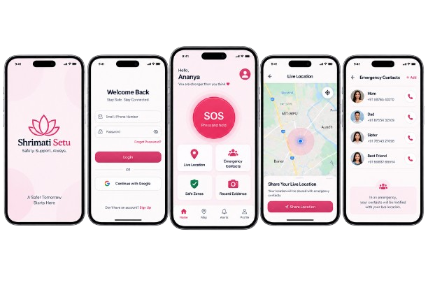
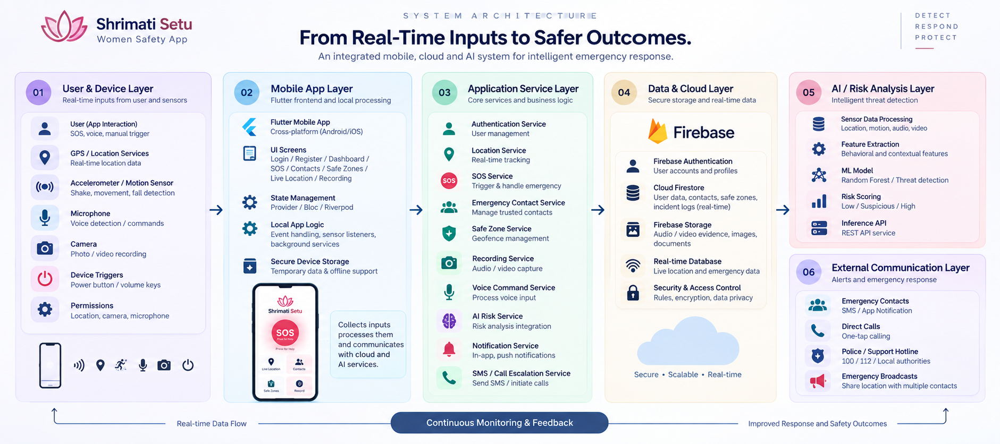

<div align="center">

# 🛡️ Shrimati Setu — Women Safety App

</div>

<div align="center">
  
</div>

A Flutter-based mobile safety application designed to help women respond quickly in emergency situations through SOS alerts, live location sharing, geofencing, voice triggers, and AI-assisted risk detection.

## ✨ Overview

Shrimati Setu is a women safety and emergency response application built using Flutter and Dart. It focuses on fast action, minimal user effort, and real-time emergency assistance. The app combines device sensors, Firebase services, and AI-based risk detection to support users during unsafe situations.

## 🚨 Key Features

- One-tap SOS emergency trigger
- Live GPS location tracking
- Emergency contacts and instant alerts
- Safe zone / geofencing management
- Motion and shake detection
- Voice-based SOS activation
- Hardware trigger support via power/volume buttons
- Audio and video evidence capture
- Firebase-backed user and incident data storage
- AI-based risk assessment for suspicious activity

## 🏗️ System Architecture



This architecture represents the complete app flow from device sensors and user interaction to Firebase storage, AI risk analysis, and emergency response actions. It is organized into layered components:

- User & Device Layer: GPS, microphone, camera, accelerometer, button triggers
- Mobile App Layer: Flutter UI, state logic, local services
- Application Service Layer: SOS flow, safe zones, voice detection, contacts, notifications
- Data & Cloud Layer: Firebase Authentication, Firestore, Storage
- AI Layer: ML risk classification and inference API
- External Communication Layer: SMS, calls, emergency alerts

## 💻 Tech Stack

| Layer | Technologies |
| :--- | :--- |
| Mobile App | Flutter, Dart |
| Backend & Storage | Firebase Auth, Firestore, Firebase Storage |
| Location | Geolocator, Google Maps |
| Sensors & Media | Sensors Plus, Camera, Speech-to-Text |
| Communication | URL Launcher, Phone Direct Caller |
| AI / Risk Detection | Python, scikit-learn, REST API |
| State Management | Provider |

## 📁 Project Structure

```text
womensafetyapp/
├── android/
├── ios/
├── lib/
│   ├── core/
│   ├── models/
│   ├── providers/
│   ├── screens/
│   └── services/
├── ml/
│   ├── evaluate_model.py
│   ├── inference_api.py
│   ├── preprocess.py
│   ├── train_model.py
│   └── requirements.txt
├── test/
├── assets/
├── pubspec.yaml
├── README.md
└── firebase_options.dart
```

## 🚀 Getting Started

### Prerequisites

- Flutter SDK
- Android Studio / Xcode
- Firebase project
- Python 3.x for ML backend

### Install dependencies

```bash
git clone <repo-url>
cd womensafetyapp
flutter pub get
```

### Run the app

```bash
flutter run
```

### Firebase setup

- Add your Firebase configuration files
- Enable Authentication, Firestore, and Storage
- Configure required Android/iOS permissions

## ⚙️ Configuration

This app requires access to several device features for emergency functionality:

- Location access for live tracking and geofencing
- Camera access for evidence recording
- Microphone access for voice detection
- Sensor access for motion and shake detection
- SMS and call permissions for emergency communication

Google Maps and Firebase keys must also be configured before running the app on a device.

## 🔒 Security & Privacy

- Location and emergency data should be handled securely
- Sensitive recordings should be stored in Firebase Storage with proper access rules
- Permissions must be requested only when needed
- Emergency communication should be limited to trusted contacts and authorized authorities

## 🔮 Future Enhancements

- Predictive risk scoring using larger behavioral datasets
- Admin dashboard for monitoring SOS events
- Automated escalation to helpline or emergency contacts
- More advanced AI-based threat classification
- Improved safe route and travel monitoring

## ✅ Conclusion

Shrimati Setu is designed to provide fast, reliable, and practical safety support in critical moments. By combining mobile app intelligence, real-time data collection, cloud infrastructure, and AI-powered risk analysis, it creates a strong emergency response ecosystem for women’s safety.
