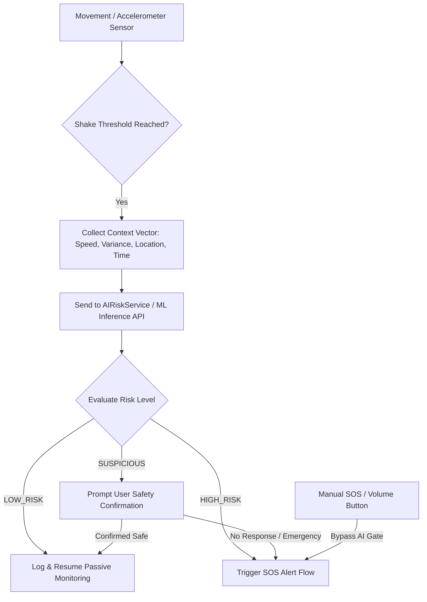

<div align="center">

  # 🛡️ Shrimati Setu — Women Safety App
  ### *AI-Powered Emergency Response, Live Location Tracking & Smart Contextual Safety System*

  [](https://flutter.dev)
  [](https://dart.dev)
  [](https://firebase.google.com)
  [](https://python.org)
  [](https://scikit-learn.org)
  [](https://flutter.dev)

  <p align="center">
    <b>Shrimati Setu</b> is a comprehensive, production-grade mobile safety application designed to protect women in emergency situations. It combines one-tap SOS alerts, hands-free voice triggers, hardware button activation, real-time geofencing, automatic evidence recording, and cutting-edge <b>AI-driven contextual threat detection</b> to minimize false alarms while guaranteeing instant emergency response.
  </p>

</div>

---

## 📑 Table of Contents

- [✨ Key Features](#-key-features)
- [🧠 AI-Powered Threat Detection Engine](#-ai-powered-threat-detection-engine)
- [🏗️ System Architecture](#️-system-architecture)
- [💻 Tech Stack](#-tech-stack)
- [📁 Project Directory Structure](#-project-directory-structure)
- [🚀 Quick Start & Installation](#-quick-start--installation)
  - [Mobile App (Flutter Setup)](#1-mobile-app-flutter-setup)
  - [AI Inference API (Python Setup)](#2-ai-inference-api-python-setup)
- [⚙️ Configuration & Permissions](#️-configuration--permissions)
- [🧪 Testing & Model Evaluation](#-testing--model-evaluation)
- [🔒 Privacy & Security Standards](#-privacy--security-standards)
- [🤝 Contributing](#-contributing)
- [📄 License](#-license)

---

## ✨ Key Features

### 🚨 1. Multi-Trigger Emergency SOS System
- **One-Tap SOS Dashboard**: Instant high-priority emergency triggering from the main screen.
- **Hardware Triggering**: Continuous volume and power button monitoring for covert, hands-in-pocket distress activation (`PowerButtonService`).
- **Shake Detection**: Accelerometer-driven motion sensing for automatic emergency detection (`sensors_plus`).
- **Hands-Free Voice SOS**: Speech-to-text distress phrase recognition (`SpeechToText`, `VoiceCommandService`).
- **Timer Safety Countdown**: Configurable safety timer (`TimerSOSScreen`) for unsafe journeys—automatically alerts contacts if unconfirmed upon expiry.

### 🤖 2. Contextual AI Risk Engine
- **Smart False-Positive Prevention**: Evaluates motion intensity, speed, location accuracy, time of day, and movement variance to distinguish between normal activities (running, dancing, riding in a vehicle) and real distress.
- **3-Tiered Risk Scoring**:
  - `LOW_RISK`: Silently filters out non-threatening shakes.
  - `SUSPICIOUS`: Prompts user for a safety check confirmation before escalating.
  - `HIGH_RISK`: Immediately triggers full SOS broadcast and evidence collection.
- **Fail-Safe Fallback**: Hardware and manual SOS bypass AI gates entirely. In case of network offline status or API timeout, the system gracefully falls back to local Dart rule classification.

### 📍 3. Live Location Tracking & Smart Geofencing
- **Real-Time GPS Tracking**: Streams accurate live location coordinates (`Geolocator`, `google_maps_flutter`).
- **Safe Zone Geofencing**: Custom perimeter creation with radius controls (`SafeZoneManagementScreen`).
- **Boundary Violation Alerts**: Triggers real-time notifications when a user exits configured safe perimeters (`GeofenceService`).

### 📞 4. Instant SMS & Direct Emergency Calling
- **Automatic Native SMS**: Dispatches SMS messages with direct Google Maps live location links to all trusted emergency contacts (`SmsService`).
- **Direct Cellular Calling**: Instant direct dialing to primary emergency contacts or police hotlines (`FlutterPhoneDirectCaller`, `CallService`).

### 🎥 5. Automatic Evidence Collection & Storage
- **Background Video/Audio Recording**: Captures encrypted video/audio footage upon SOS activation (`RecordingService`, `camera`).
- **Cloud Evidence Vault**: Automatically uploads incident footage to secure Firebase Storage with user metadata (`storage_service.dart`).
- **In-App Media Player**: Playback recorded emergency clips for verification and documentation (`RecordingsScreen`, `video_player`).

### 🎨 6. Modern Glassmorphic UI & Dynamic Themes
- **Adaptive Dark/Light Theme**: Seamless transition powered by `ThemeProvider`.
- **Fluid Lottie Animations**: Engaging interactive feedback and micro-interactions (`lottie`).

---

## 🧠 AI-Powered Threat Detection Engine

The AI subsystem uses a **Random Forest Classifier** trained on movement, location, and situational context parameters.



### Context Feature Matrix
| Feature Category | Parameters |
| :--- | :--- |
| **Motion Metrics** | Shake Count, Intensity, Duration (ms), Movement Variance, Movement Frequency |
| **Location & Speed** | GPS Speed, Location Accuracy, Location Availability Flag, Geofence Violation |
| **Distress Indicators** | Voice Distress Flag, Recent Automatic Triggers, Recent SOS Count, Time Delta |
| **Temporal Context** | Hour of Day (0–23) |

---

## 🏗️ System Architecture

```text
womensafetyapp/
├── lib/                        # Flutter Mobile Frontend & Core Services
│   ├── main.dart               # App Entrypoint & Provider Setup
│   ├── firebase_options.dart   # Firebase Environment Config
│   ├── models/                 # User, Contact, SafeZone & Alert Models
│   ├── providers/              # Application State Management
│   ├── screens/                # Flutter UI Views & Dashboards
│   └── services/               # Native Hardware, AI & Cloud Services
├── ml/                         # Python Machine Learning Subsystem
│   ├── dataset/                # Synthetic & Benchmark Context Datasets
│   ├── preprocess.py           # Feature Pipeline & Data Normalization
│   ├── train_model.py          # Random Forest Model Training Script
│   ├── evaluate_model.py       # Metrics Evaluation (Precision, Recall, F1)
│   └── inference_api.py        # REST API Server for AI Predictions
├── dataset/                    # Training Datasets (.csv)
├── test/                       # Unit & Service Integration Tests
└── android/ ios/               # Native Mobile Project Files
```

---

## 💻 Tech Stack

| Domain | Technology / Package | Purpose |
| :--- | :--- | :--- |
| **Mobile Framework** | Flutter 3.10+, Dart | Cross-platform mobile app development |
| **Backend & Cloud** | Firebase Auth, Cloud Firestore, Firebase Storage | User authentication, database & media storage |
| **Hardware & Sensors** | `sensors_plus`, `camera`, `speech_to_text`, `volume_controller` | Motion sensors, video camera, voice recognition & hardware key triggers |
| **Location Services** | `geolocator`, `geocoding`, `google_maps_flutter` | Real-time map rendering, GPS tracking & reverse geocoding |
| **Communication** | `permission_handler`, `url_launcher`, `flutter_phone_direct_caller` | Native SMS dispatch, phone calls & permission management |
| **Machine Learning** | Python, Scikit-Learn, Pandas, NumPy | Threat classifier model development & feature pipeline |
| **Inference Server** | Python Flask / REST API | Serving AI predictions to mobile clients |
| **UI Components** | Provider, Google Fonts, Lottie, Cupertino Icons | State management, dynamic themes & smooth animations |

---

## 📁 Project Directory Structure

```text
lib/
├── core/
├── models/
│   ├── boundary_alert.dart
│   ├── contact_model.dart
│   ├── incident_model.dart
│   ├── safe_zone.dart
│   └── user_model.dart
├── screens/
│   ├── auth/
│   ├── emergency_contacts_screen.dart
│   ├── home_screen.dart
│   ├── live_location_screen.dart
│   ├── login_screen.dart
│   ├── onboarding_screen.dart
│   ├── profile_setup_screen.dart
│   ├── recordings_screen.dart
│   ├── register_screen.dart
│   ├── safe_zone_management_screen.dart
│   ├── safe_zone_map_screen.dart
│   ├── splash_screen.dart
│   └── timer_sos_screen.dart
└── services/
    ├── ai_risk_service.dart
    ├── auth_service.dart
    ├── call_service.dart
    ├── database_service.dart
    ├── firestore_service.dart
    ├── geofence_service.dart
    ├── live_location_service.dart
    ├── power_button_service.dart
    ├── recording_service.dart
    ├── safe_zone_service.dart
    ├── sms_service.dart
    ├── sos_service.dart
    ├── storage_service.dart
    ├── theme_provider.dart
    ├── timer_sos_service.dart
    └── voice_command_service.dart
```

---

## 🚀 Quick Start & Installation

### Prerequisites
- [Flutter SDK](https://docs.flutter.dev/get-started/install) (v3.10+)
- [Android Studio](https://developer.android.com/studio) / Xcode
- [Python 3.9+](https://www.python.org/downloads/) (for ML Backend)
- Firebase Account & Project

---

### 1. Mobile App (Flutter Setup)

1. **Clone the Repository**
   ```bash
   git clone https://github.com/Anshpriv/womensafetyapp.git
   cd womensafetyapp
   ```

2. **Install Flutter Dependencies**
   ```bash
   flutter pub get
   ```

3. **Configure Firebase & Maps Key**
   - Place your `google-services.json` in `android/app/`.
   - Update `lib/firebase_options.dart` with your credentials.
   - Insert your Google Maps API key into `android/app/src/main/AndroidManifest.xml`.

4. **Run the Flutter Application**
   ```bash
   # Run on connected device or emulator with default local fallback
   flutter run

   # Optional: Connect to live Python AI REST endpoint
   flutter run --dart-define=AI_RISK_API_URL=http://<YOUR_LOCAL_IP>:8080/predict
   ```

---

### 2. AI Inference API (Python Setup)

1. **Navigate to the ML Directory & Create Virtual Environment**
   ```bash
   cd ml
   python -m venv .venv
   
   # Windows Activation
   .venv\Scripts\activate
   # macOS/Linux Activation
   source .venv/bin/activate
   ```

2. **Install Requirements**
   ```bash
   pip install -r requirements.txt
   ```

3. **Train & Evaluate Model**
   ```bash
   # Train the Random Forest Model
   python train_model.py

   # Evaluate Performance
   python evaluate_model.py
   ```

4. **Start the Inference REST Server**
   ```bash
   python inference_api.py --host 0.0.0.0 --port 8080
   ```

---

## ⚙️ Configuration & Permissions

The application requires specific runtime permissions for emergency functionality:

| Platform | Permission | Reason |
| :--- | :--- | :--- |
| **Android / iOS** | `ACCESS_FINE_LOCATION`, `ACCESS_BACKGROUND_LOCATION` | Real-time GPS tracking & Geofence boundary detection |
| **Android / iOS** | `SEND_SMS`, `CALL_PHONE` | Direct emergency SMS dispatch & automated calls |
| **Android / iOS** | `RECORD_AUDIO`, `CAMERA` | Audio voice distress detection & emergency video evidence recording |
| **Android** | `READ_EXTERNAL_STORAGE`, `WRITE_EXTERNAL_STORAGE` | Storing local emergency recordings prior to cloud sync |

---

## 🧪 Testing & Model Evaluation

### Running Flutter Unit & Integration Tests
```bash
flutter test
```
*Tests cover AI risk service fallbacks, shake classification scenarios, emergency contact management, and SOS workflow execution.*

### Testing the AI REST Endpoint
```bash
curl -X POST http://127.0.0.1:8080/predict \
  -H "Content-Type: application/json" \
  -d '{
    "features": {
      "trigger_type": "shake",
      "shake_count": 3,
      "shake_intensity": 18,
      "shake_duration_ms": 2000,
      "movement_variance": 22,
      "movement_frequency": 28,
      "speed": 0.5,
      "accuracy": 8,
      "location_available": 1,
      "geofence_violation": 1,
      "distress_voice_detected": 0,
      "recent_automatic_trigger_count": 2,
      "recent_sos_count": 0,
      "seconds_since_previous_trigger": 120,
      "hour_of_day": 23
    }
  }'
```

---

## 🔒 Privacy & Security Standards

- **Zero Unnecessary Data Collection**: Passive sensor telemetry is processed locally or ephemerally evaluated. Low-risk shake events are not logged to remote databases.
- **Fail-Safe Design**: Explicit manual SOS button and volume key actions bypass all software analysis gates to guarantee immediate response.
- **Secure Cloud Storage**: Incident recordings and emergency contact information are stored using encrypted Firebase rules restricted to authenticated users.

---

## 🤝 Contributing

Contributions are welcome! If you'd like to improve features, refine ML threat detection models, or improve UI accessibility:

1. Fork the Project Repository.
2. Create your Feature Branch (`git checkout -b feature/AmazingFeature`).
3. Commit your Changes (`git commit -m 'feat: Add AmazingFeature'`).
4. Push to the Branch (`git push origin feature/AmazingFeature`).
5. Open a Pull Request.

---

## 📄 License

Distributed under the **MIT License**. See `LICENSE` for more details.

---

<div align="center">
  <sub>Developed with ❤️ for safety, security, and empowerment.</sub>
</div>
